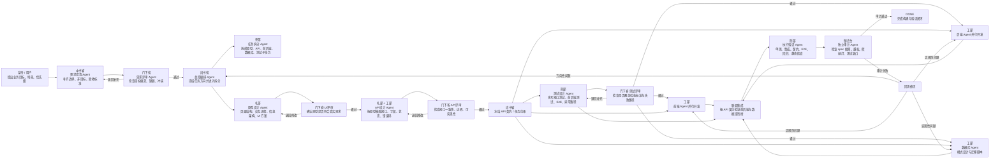

# MAS V1 架构设计稿

## 1. 设计目标
- 为 MAS V1 建立一套可以落地执行的多 Agent 协作开发流程，用来约束 AI 从需求到构建完成的全过程。
- 采用“单总控编排 + 有限平级协商”的组织方式，在关键评审节点允许多 Agent 协商，在执行阶段保持强门禁与强收敛。
- 先解决需求偏差、原型偏差、API 偏差、测试缺失和假绿灯问题，不在 V1 中引入发布运维复杂度。

## 2. V1 核心原则
- 方向层与实现层必须分离。
- 原型设计优先，API 设计跟随原型。
- API 契约冻结后，前后端与数据库按约束并行推进。
- 测试先于代码，是进入构建阶段的硬门禁。
- 运维发布暂不纳入 V1 范围，只做到构建、验证、审计完成。
- 全流程必须保留审计轨迹，避免无法追溯的越权改动。

## 3. 角色映射
| 古代职责 | MAS 对应 | 作用说明 |
| --- | --- | --- |
| 皇帝 | 用户 / 目标源头 | 提供业务目标、场景、优先级与边界条件 |
| 中书省 | 需求澄清 Agent | 将自然语言需求整理为可执行 spec |
| 门下省 | 评审 Agents | 审核需求、UI、API、测试，负责封驳与纠偏 |
| 尚书省 | 总控编排 Agent | 推进状态机、冻结里程碑、决定回流去向 |
| 吏部 | 任务拆分 Agent | 把任务拆成原型、API、前后端、数据库、测试等子任务 |
| 礼部 | 原型设计 Agent | 负责原型、交互、信息架构和 UI 方案 |
| 工部 | 实现 Agents | 负责 API、前端、后端、数据库设计与迁移 |
| 刑部 | 规则与测试 Agents | 负责规则、测试设计、验证和质量门禁 |
| 御史台 | 审计 Agent | 独立检查 spec 偏离、越权改动和假绿灯 |

## 4. 执行流程图


## 5. 平级协商边界
- 需求澄清
- 需求评审
- 任务拆分
- UI 评审
- API 评审
- 重大分歧复议

只有在上述节点允许多个 Agent 讨论同一问题。进入 API 已冻结、测试已通过评审之后，必须收敛到总控编排，避免系统重新发散。

## 6. V1 目录结构
```text
workspace/
├─ tasks/
│  └─ <task-id>/
│     ├─ 00-intake/
│     │  ├─ request.md
│     │  ├─ context.md
│     │  └─ constraints.md
│     ├─ 01-spec/
│     │  ├─ spec.md
│     │  ├─ acceptance.md
│     │  └─ non-goals.md
│     ├─ 02-review/
│     │  ├─ requirement-review.md
│     │  ├─ ui-review.md
│     │  ├─ api-review.md
│     │  └─ test-review.md
│     ├─ 03-plan/
│     │  ├─ task-breakdown.md
│     │  ├─ dependency-map.md
│     │  └─ ownership.md
│     ├─ 04-design/
│     │  ├─ prototype.md
│     │  ├─ api-contract.yaml
│     │  ├─ data-model.md
│     │  └─ migration-plan.md
│     ├─ 05-rules/
│     │  ├─ rules.md
│     │  ├─ allowed-files.md
│     │  ├─ dependency-policy.md
│     │  └─ quality-gates.md
│     ├─ 06-tests/
│     │  ├─ test-cases.md
│     │  ├─ contract/
│     │  ├─ frontend/
│     │  ├─ backend/
│     │  └─ e2e/
│     ├─ 07-build/
│     │  ├─ frontend/
│     │  ├─ backend/
│     │  ├─ database/
│     │  └─ generated-summary.md
│     ├─ 08-verify/
│     │  ├─ test-results.md
│     │  ├─ contract-results.md
│     │  ├─ build-results.md
│     │  └─ integration-results.md
│     ├─ 09-audit/
│     │  ├─ review.md
│     │  ├─ findings.md
│     │  ├─ risk-register.md
│     │  └─ compliance.md
│     ├─ agent-log.md
│     ├─ state.json
│     └─ manifest.json
├─ shared/
│  ├─ templates/
│  ├─ policies/
│  ├─ schemas/
│  └─ prompts/
└─ orchestrator/
   ├─ state-machine.md
   ├─ routing-rules.md
   └─ role-permissions.md
```

## 7. 状态机
```text
INTAKE
-> SPEC_DRAFT
-> REQUIREMENT_REVIEW
-> TASK_PLANNED
-> PROTOTYPE_DRAFT
-> UI_REVIEW
-> API_DESIGNED
-> API_REVIEW
-> RULES_FROZEN
-> TESTS_DRAFTED
-> TEST_REVIEW
-> BUILD_IN_PROGRESS
-> INTEGRATION_VERIFY
-> AUDIT_REVIEW
-> DONE
```

失败回流：

```text
REQUIREMENT_REJECTED -> SPEC_DRAFT
UI_REJECTED -> PROTOTYPE_DRAFT
API_REJECTED -> API_DESIGNED
TEST_REJECTED -> TESTS_DRAFTED
VERIFY_FAILED -> BUILD_IN_PROGRESS
AUDIT_FAILED -> TASK_PLANNED or BUILD_IN_PROGRESS
```

失败状态枚举：

```text
REQUIREMENT_REJECTED
UI_REJECTED
API_REJECTED
TEST_REJECTED
VERIFY_FAILED
AUDIT_FAILED
```

## 8. 节点作用说明
- `SPEC_DRAFT`：把用户输入整理为结构化 spec。
- `REQUIREMENT_REVIEW`：审查需求是否完整、一致、可执行。
- `TASK_PLANNED`：完成任务拆分、依赖关系和责任归属。
- `PROTOTYPE_DRAFT`：产出原型、页面流和信息架构。
- `UI_REVIEW`：确认原型符合用户真实需求。
- `API_DESIGNED`：从原型抽取接口、字段、状态和错误码。
- `API_REVIEW`：验证 API 约束是否一致、完整、可实现。
- `RULES_FROZEN`：冻结 API 契约和实现规则，进入可执行阶段。
- `TESTS_DRAFTED`：先产出覆盖验收标准和失败路径的测试设计。
- `TEST_REVIEW`：确认测试能真实兜底，不是假绿灯模板。
- `BUILD_IN_PROGRESS`：前端、后端、数据库在授权范围内并行推进。
- `INTEGRATION_VERIFY`：联调、契约验证、集成测试与构建检查。
- `AUDIT_REVIEW`：独立审计偏差、越权和测试缺口。
- `DONE`：构建与验证完成，形成可追溯产物。
- `REQUIREMENT_REJECTED`：需求评审未通过，退回补 spec。
- `UI_REJECTED`：UI 评审未通过，退回补原型。
- `API_REJECTED`：API 评审未通过，退回补接口设计。
- `TEST_REJECTED`：测试评审未通过，退回补测试设计。
- `VERIFY_FAILED`：验证失败，回到构建修复实现问题。
- `AUDIT_FAILED`：审计失败，根据问题类型回流到任务规划或构建阶段。

## 9. 权限模型
- 中书省 Agent 只写 intake/spec 相关目录。
- 门下省 Agent 只写 review 相关目录。
- 尚书省 Agent 只写 plan、状态与路由控制文件。
- 吏部 Agent 只写任务拆分文档。
- 礼部 Agent 只写原型与交互设计文档。
- 工部 Agents 只写 API、实现与数据库相关产物。
- 刑部 Agents 只写 rules、tests 和 verify 相关产物。
- 御史台 Agent 只写 audit 文档。
- 所有 Agent 默认只读 spec、rules、tests、state 和 manifest。

## 10. 并行策略
- API 冻结前不允许实现类 Agent 并行开发。
- 前端、后端、数据库 Agent 在 `BUILD_IN_PROGRESS` 中并行推进。
- 契约校验、测试执行、联调验证可在 `INTEGRATION_VERIFY` 中并行。
- 审计可拆成合规、测试质量和偏差检查并行执行。

## 11. 这套机制适合解决的 AI 开发问题
- 需求理解不一致导致实现方向偏差。
- 原型和 API 不同步，前后端接口长期漂移。
- 测试后置导致“代码完成后才发现验收标准不成立”。
- 多 Agent 并行开发时越权改动、重复劳动、难以回溯。
- 构建通过但测试无效，形成假绿灯。

## 12. V1 实施建议
- 第一阶段先完成任务目录脚手架。
- 第二阶段落地状态机和最小路由规则。
- 第三阶段接入 `state.json` 与 `manifest.json` schema 校验。
- 第四阶段再逐步增强 orchestrator 与多 Agent 分工能力。

## 13. `state.json` Schema
`state.json` 是运行时控制面，用来表示当前任务位于哪个阶段、已批准哪些产物、由谁负责推进，以及是否存在风险或阻塞。

### 字段定义
| 字段 | 类型 | 必填 | 说明 |
| --- | --- | --- | --- |
| `task_id` | string | 是 | 当前任务唯一标识 |
| `current_state` | string | 是 | 当前运行状态 |
| `previous_state` | string \| null | 是 | 上一个状态，起始阶段可为 `null` |
| `owner` | string | 是 | 当前负责推进的 Agent 或 orchestrator id |
| `approved_artifacts` | object | 是 | 各类阶段产物的批准情况 |
| `blocked_by` | string[] | 是 | 当前阻塞项 id 或阻塞 Agent id |
| `active_agents` | string[] | 是 | 当前活跃 Agent 列表 |
| `allowed_write_paths` | string[] | 是 | 当前阶段允许写入的路径前缀 |
| `risks` | object[] | 是 | 当前已知风险列表 |
| `updated_at` | string | 是 | 最近更新时间，ISO 8601 格式 |

### `current_state` 枚举
```text
INTAKE
SPEC_DRAFT
REQUIREMENT_REVIEW
TASK_PLANNED
PROTOTYPE_DRAFT
UI_REVIEW
API_DESIGNED
API_REVIEW
RULES_FROZEN
TESTS_DRAFTED
TEST_REVIEW
BUILD_IN_PROGRESS
INTEGRATION_VERIFY
AUDIT_REVIEW
REQUIREMENT_REJECTED
UI_REJECTED
API_REJECTED
TEST_REJECTED
VERIFY_FAILED
AUDIT_FAILED
DONE
```

### `approved_artifacts` 结构
| 字段 | 类型 | 必填 | 说明 |
| --- | --- | --- | --- |
| `spec` | boolean | 是 | spec 是否通过 |
| `prototype` | boolean | 是 | 原型 / UI 是否通过 |
| `api_contract` | boolean | 是 | API 契约是否通过 |
| `rules` | boolean | 是 | 规则是否冻结 |
| `tests` | boolean | 是 | 测试设计是否通过 |
| `build` | boolean | 是 | 构建产物是否完成 |
| `verification` | boolean | 是 | 集成验证是否通过 |
| `audit` | boolean | 是 | 审计是否通过 |

### `risks[]` 结构
| 字段 | 类型 | 必填 | 说明 |
| --- | --- | --- | --- |
| `id` | string | 是 | 风险 id，如 `R-001` |
| `level` | string | 是 | `low`、`medium`、`high` 或 `critical` |
| `summary` | string | 是 | 风险摘要 |
| `status` | string | 是 | `open`、`mitigated` 或 `accepted` |
| `owner` | string | 是 | 风险责任 Agent 或角色 |

### 示例
```json
{
  "task_id": "task-001",
  "current_state": "API_REVIEW",
  "previous_state": "API_DESIGNED",
  "owner": "shangshu-orchestrator",
  "approved_artifacts": {
    "spec": true,
    "prototype": true,
    "api_contract": false,
    "rules": false,
    "tests": false,
    "build": false,
    "verification": false,
    "audit": false
  },
  "blocked_by": [
    "menxia-api-review"
  ],
  "active_agents": [
    "shangshu-orchestrator",
    "libu-prototype",
    "gongbu-api"
  ],
  "allowed_write_paths": [
    "tasks/task-001/02-review/",
    "tasks/task-001/04-design/"
  ],
  "risks": [
    {
      "id": "R-001",
      "level": "high",
      "summary": "原型已通过，但 API 错误模型仍未收敛",
      "status": "open",
      "owner": "gongbu-api"
    }
  ],
  "updated_at": "2026-03-24T10:30:00+08:00"
}
```

## 14. `manifest.json` Schema
`manifest.json` 是任务静态配置面，用来描述任务元数据、审批要求、部门分工、产物路径、路由策略以及全局约束。

### 字段定义
| 字段 | 类型 | 必填 | 说明 |
| --- | --- | --- | --- |
| `task_id` | string | 是 | 任务唯一标识 |
| `title` | string | 是 | 任务标题 |
| `priority` | string | 是 | `low`、`medium`、`high` 或 `critical` |
| `goal` | string | 是 | 任务目标描述 |
| `human_approvals_required` | string[] | 是 | 必须人工确认的状态列表 |
| `departments` | object | 是 | 各部门对应的 Agent 列表 |
| `artifacts` | object | 是 | 各关键产物路径 |
| `routing_policy` | object | 是 | 平级协商、并行执行与串行门禁策略 |
| `constraints` | object | 是 | 来源于 spec 的全局约束 |

### `departments` 结构
以下 key 必须明确出现，不能再用单一 `libu` 混合任务拆分与原型职责：

```text
zhongshu
menxia
shangshu
libu_task_breakdown
libu_prototype
gongbu
xingbu
yushitai
```

### `artifacts` 结构
| 字段 | 类型 | 必填 | 说明 |
| --- | --- | --- | --- |
| `spec` | string | 是 | spec 文件路径 |
| `prototype` | string | 是 | 原型文件路径 |
| `api_contract` | string | 是 | API 契约文件路径 |
| `rules` | string | 是 | 规则文件路径 |
| `tests` | string | 是 | 测试设计文件路径 |
| `audit` | string | 是 | 审计 / review 文件路径 |

### `routing_policy` 结构
| 字段 | 类型 | 必填 | 说明 |
| --- | --- | --- | --- |
| `peer_deliberation_states` | string[] | 是 | 允许平级 Agent 协商的状态 |
| `parallel_execution_states` | string[] | 是 | 允许并行执行的状态 |
| `serialized_gates` | string[] | 是 | 必须串行通过的门禁状态 |
| `freeze_points` | string[] | 是 | 通过后应冻结上游输入的状态 |

### 示例
```json
{
  "task_id": "task-001",
  "title": "用户注册与仪表盘流程",
  "priority": "high",
  "goal": "建立从原型驱动到测试前置的多 Agent 开发闭环",
  "human_approvals_required": [
    "REQUIREMENT_REVIEW",
    "UI_REVIEW",
    "API_REVIEW"
  ],
  "departments": {
    "zhongshu": ["spec-agent"],
    "menxia": ["requirement-reviewer", "ui-reviewer", "api-reviewer", "test-reviewer"],
    "shangshu": ["orchestrator-agent"],
    "libu_task_breakdown": ["task-breakdown-agent"],
    "libu_prototype": ["prototype-agent"],
    "gongbu": ["api-agent", "frontend-agent", "backend-agent", "database-agent"],
    "xingbu": ["rules-agent", "test-agent", "verify-agent"],
    "yushitai": ["audit-agent"]
  },
  "artifacts": {
    "spec": "tasks/task-001/01-spec/spec.md",
    "prototype": "tasks/task-001/04-design/prototype.md",
    "api_contract": "tasks/task-001/04-design/api-contract.yaml",
    "rules": "tasks/task-001/05-rules/rules.md",
    "tests": "tasks/task-001/06-tests/test-cases.md",
    "audit": "tasks/task-001/09-audit/review.md"
  },
  "routing_policy": {
    "peer_deliberation_states": [
      "SPEC_DRAFT",
      "REQUIREMENT_REVIEW",
      "TASK_PLANNED",
      "UI_REVIEW",
      "API_REVIEW"
    ],
    "parallel_execution_states": [
      "BUILD_IN_PROGRESS",
      "INTEGRATION_VERIFY"
    ],
    "serialized_gates": [
      "REQUIREMENT_REVIEW",
      "UI_REVIEW",
      "API_REVIEW",
      "TEST_REVIEW",
      "AUDIT_REVIEW"
    ],
    "freeze_points": [
      "UI_REVIEW",
      "API_REVIEW",
      "TEST_REVIEW"
    ]
  },
  "constraints": {
    "prototype_first": true,
    "api_follows_prototype": true,
    "tests_before_code": true,
    "deployment_in_scope": false
  }
}
```
